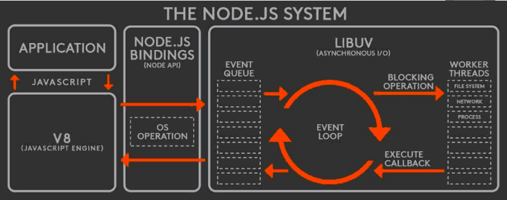

## 模块
### CommonJS模块规范
以前加载 JS 的唯一方式：`<script>`，这个会有什么问题呢？
- 脚本变多时，需要手动管理加载顺序。
- 不同脚本之间逻辑调用，需要通过全局变量的方式。
- 没有 html 怎么办？这个例子就是 Node.js
于是 Node.js 就有了 CommonJS 模块规范，Webpack 也是兼容了 CommonJS 的写法，让我们可以用 CommonJS 规范来写前端代码

CommonJS 模块规范
- JavaScript 社区发起，在 Node.js 上应用并推广。
- 后续也影响到了浏览器端 JavaScript。

### require
CommonJS 模块规范的 API，用来引入要使用的文件
```js
require('./lib');
```
`require` 默认返回一个空对象，可以通过 `exports` 来挂载一些属性：对象、函数、字符串等类型的数据
```js
exports.hello = "world"
exports.add = function (a, b) {
  return a + b;
}
exports.obj = { hello: "Node" }
```
当然也可以返回其它类型的数据，如返回一个函数，可以通过 `module.exports` 的方式：
```js
module.exports = function minus(a, b) {
  return a - b;
}
```
在 `require` 一个模块时，`module.exports` 的优先级要高于 `exports`，所以如果指定了 `module.exports`，那么就会使用 `module.exports` 指定的对象，如果没有指定 `module.exports`，就会使用 `exports` 对象

可以通过 webpack 打包好的文件来看它（`module.exports`、`exports`）是怎样运行的：
```
webpack --devtool none --mode development --target node index.js
```

### npm
推荐用 `nvm` 管理本地开发机器上的 `node` 版本，用 `nrm` 管理 `npm` 镜像地址
npm 是什么
- Node.js 的包管理工具

包是什么
- 别人写的 Node.js 模块

npm 初始化：
```
npm init
```
安装包 `<packageName>`：
```
npm install <packageName>
```
全局安装
```
npm install <packageName> -g
```
npm 使用遇到问题可以登录官网找解决办法：`docs.npmjs.com`

### Node.js 内置模块


EventEmitter
- 观察者模式
  - `addEventListener`
  - `removeEventListener`
- 调用 vs 抛事件
  - 关键在于“不知道被通知者存在”
  - 以及“没有人听还能继续下去”