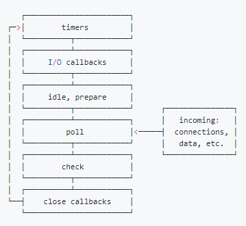

## 异步


### Node.js 的非阻塞 I/O
- I/O 即 `Input`/`Output`，一个系统的输入和输出。
- 阻塞 I/O 和非阻塞 I/O 的区别就在于**系统接收输入再到输出期间，能不能接收其他输入**。

理解非阻塞 I/O 的要点在于
- 确定一个进行 `Input`/`Output` 的系统。
- 思考在 I/O 过程中，能不能进行其他 I/O。

### Node.js 异步编程 - `callback`
- 回调函数格式规范
  - error-first callback
  - node-style callback
- 第一个参数是 `error`，后面的参数才是结果。
```js
interview(function (err, res) {
  if (err) {
    console.log('cry')
    return;
  }
  console.log('smile')
})
```
异步流程控制：回调地狱、异步并发等问题
- `npm`：`async.js`；可以通过 `async.js` 来控制异步流程
- thunk：一种编程方式

### 事件循环
Node.js启动的时候会初始化由libuv提供的事件循环，每次的事件循环都包含6个阶段，这6个阶段会在每一次的事件循环当中按照下图当中的顺序反复执行，如下图：

- `timers` 阶段：这个阶段执行 `timer`（`setTimeout`、`setInterval`）的回调
- I/O `callbacks` 阶段 ：处理一些上一轮循环中的少数未执行的 I/O 回调
- `idle`, `prepare` 阶段 ：仅 node 内部使用
- `poll` 阶段 ：获取新的 I/O 事件, 适当的条件下 node 将阻塞在这里
- `check` 阶段 ：执行 `setImmediate()` 的回调
- `close callbacks` 阶段：执行 `socket` 的 `close` 事件回调
每个阶段都有一个先入先出的（FIFO）的用于执行回调的队列，事件循环运行到每个阶段，都会从对应的回调队列中取出回调函数去执行，直到队列当中的内容耗尽，或者执行的回调数量达到了最大。然后事件循环就会进入下一个阶段，然后又从下一个阶段对应的队列中取出回调函数执行，这样反复直到事件循环的最后一个阶段。而事件循环也会一个一个按照循环执行，直到进程结束。

事件循环当中的6个宏队列和微队列的关系如下：微队列（`microtask`）在事件循环的各个阶段之间执行，或者说在事件循环的各个阶段对应的宏队列（`macrotask`）之间执行。

这里有一个特别容易混淆的版本改变：
- 如果是 node10 及其之前版本：宏队列当中的有几个宏任务，是要等到宏队列当中的所有宏任务全部执行完毕才会去执行微队列当中的微任务
- 如果是 node11 版本：一旦执行一个阶段里对应宏队列当中的一个宏任务(`setTimeout`，`setInterval` 和 `setImmediate`三者其中之一，不包括I/O)就立刻执行微任务队列，执行完微队列当中的所有微任务再回到刚才的宏队列执行下一个宏任务。这就跟浏览器端运行一致了。
